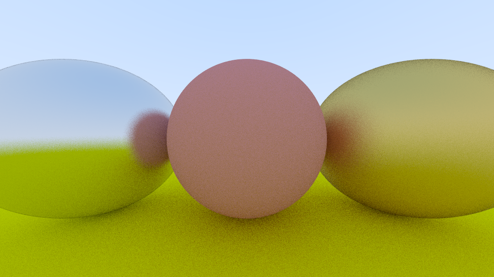

# Ray Tracing from Scratch

*(~100 samples/pixel, ray depth = 10)*

Building raytracing engine from scratch, following https://raytracing.github.io/books/RayTracingInOneWeekend.html as a starting point.

This project extends the starter code by implementing real-time rendering and displaying with [SDL](https://www.libsdl.org/) library. Also allows user to control camera position with arrow keys to move up/left/down/right and `E` & `D` keys to control depth.

The shading algorithm loosely follows the [Phong reflection model](https://en.wikipedia.org/wiki/Phong_reflection_model), by multiplying `Color` vectors together when light rays hit surfaces, according to the material. The `Color` vectors are then normalized with gamma correction.

Ran experiments with custom-built ThreadPool to speed up rendering. However, in practice it actually slowed down rendering. This could be due to bad design of the thread jobs.

## Progress Log

1. Implemented Spherical objects and light bouncing. The light bounces off these objects with Lambertian diffusion. A random vector in the unit sphere around the normal vector is chosen for bouncing off objects.

2. Added coloring and different materials. The left and right spheres are reflective metals.

3. Added fuzz texture to metal materials. The more fuzz, the more blurry the reflection.

4. Added glass material. Light refracts through this sphere.

5. Implemented real-time sample-by-sample rendering with ability to move the camera with keyboard input

6. At this point, a focus distance was added to the camera. Notice the blur on the horizon. The distance to the spheres has been set as the focus distance for this image.

7. Scale down random vector in light scattering - this unintentionally had the effect of intensifying shadows because it is harder for light to escape the cracks.

8. Render final scene. Moved the camera and captured two perspectives of the same scene. 

### Some interesting details

* This scene was rendered with 100 samples per pixel. The maximum depth for each ray calculation was 15 (a ray could bounce off 15 surfaces to calculate its color). 

* Notice the reflection in the large left metal sphere and the refraction in the middle glass sphere. These were produced with vector algebra involving the rays from the camera to the objects and the surface normal vectors for those objects. The shadows were produced by rays bouncing off non-white surfaces, multiplying non-white colors until it produced a very dark color. Any rays that could escape towards the sky absorbed the sky's color.

* Notice the thin line of reflection on the top of the middle glass sphere. With some randomness, rays that were almost tangent to the glass sphere's surface were reflected instead of refracted.

* For this image, the camera has been set with a focus distance to hit the glass sphere. Notice the defocus blur in the foreground as well as the background.

* Notice on the left metal sphere, there is a reflection of the glass sphere, which flips the world upside down due to its refraction. This rendering is made possible with the high depth of ray calculations (being able to bounce off many surfaces). If we set the depth to 2, we get the following image:

